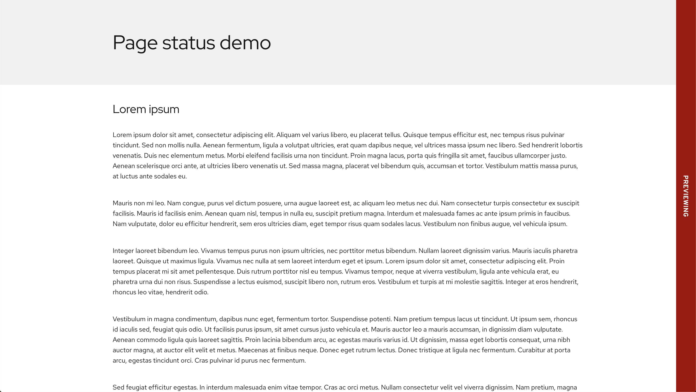

::: section header
# {{ title }}
:::

::: section
## Overview
Page Status creates a flag/banner on the right side of the page denoting the status of the page or document the author is viewing.


<br>

<pfe-cta>
  <a href="demo">View the demo</a>
</pfe-cta>
:::

::: section
## Installation

```shell
npm install @patternfly/{{ package }}
```
:::

::: section
## Usage

```html
<pfe-page-status status="critical">
  Previewing
</pfe-page-status>
```
:::

::: section
## Slots
### default slot
Content in the default slot will be used as the text for the banner on the right side of the page.
:::

::: section
## Attributes
### status
Controls the background color of the banner.

Values
- moderate
- warning
- important
- critical
- success
- info
- normal
- accent
- complement
:::

::: section
## Methods
None
:::

::: section
## Events
None
:::

::: section
## Styling hooks
| Option | Theme Color Variable |
| ------ | -------------------- |
| default | `--pfe-theme--color--feedback--default` |
| `moderate` | `--pfe-theme--color--feedback--moderate` |
| `warning` | *Same as `moderate`* |
| `important` | `--pfe-theme--color--feedback--important` |
| `critical` | `--pfe-theme--color--feedback--critical` |
| `success` | `--pfe-theme--color--feedback--success` |
| `info` | `--pfe-theme--color--feedback--info` |
| `normal` | `--pfe-theme--color--ui-accent` |
| `accent` | `--pfe-theme--color--ui-accent` |
| `complement` | `--pfe-theme--color--ui-base` |

:::